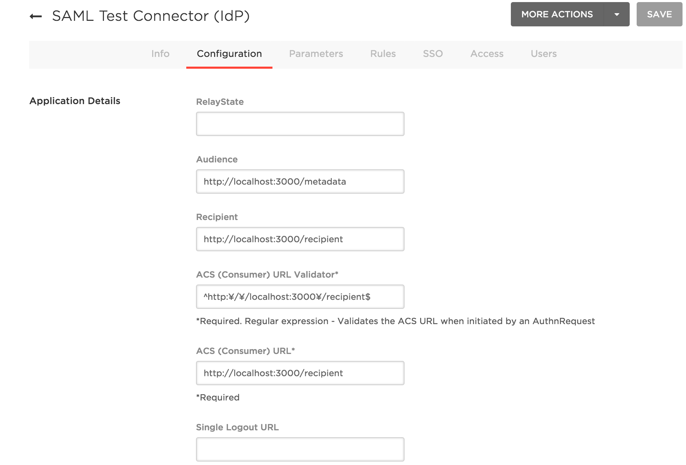

## sinatra-saml-sample

The minimal sample application with SAML written by ruby.

## Configuration

1. Add an app (choose "SAML Test Connector (IdP)")
2. Rewrite sample.rb:

```diff
- app_id = YOUR_APP_ID
+ app_id = 123456 # it's dummy number
idp_cert = <<-EOS
- ###### COPY Certificate from OneLogin
+ -----BEGIN CERTIFICATE-----
+ hogefugapiyo
+ -----END CERTIFICATE-----
EOS
```

3. Set parameters to OneLogin: 


4. Run app

```
ruby sample.rb -p 3000
```
